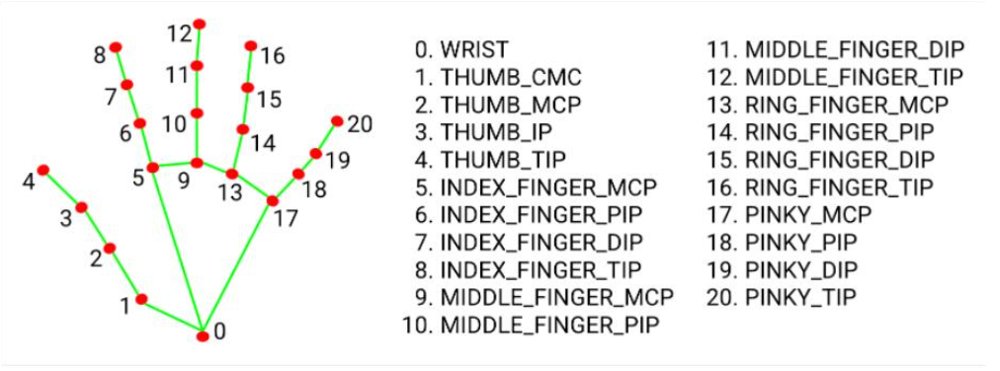

# LinearTransformationARTool
Linear Transformation AR Tool using OpenCV and C++

## HandDetect module
External Libraries: **mediapipe**

A functor that relies on mediapipe to detect presence of hand within screen. Data indexing follows the image below

## Renderer module
External Libraries: **cv2**, **mediapipe**, **typing**

Contains public member functions that can be used to render specific objects as specified within their individual classes
Currently handled for mediapipe landmark rendering and opencv text rendering

## Camera module
External Libraries: **cv2**, **numpy**

A camera class that connects to a user specified webcam and handles the rendering onto the window

## HandData module
External Libraries:  **enum**, **numpy**

Specialised for the _hand_details object in HandDetect, it stores the following data: reference offset, current offset, previous positions, current positions. The data updates are handled against a user specified treshold, and recalibration of the reference offset is available
